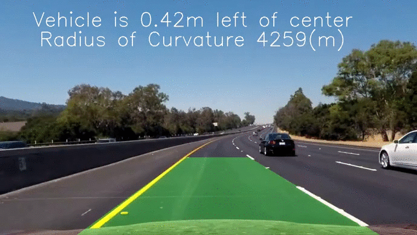

Author:Cuiqing Li

Time: 2/24/2017

**Advanced Lane Finding Project**

The goals / steps of this project are the following:

* Compute the camera calibration matrix and distortion coefficients given a set of chessboard images.
* Apply a distortion correction to raw images.
* Use color transforms, gradients, etc., to create a thresholded binary image.
* Apply a perspective transform to rectify binary image ("birds-eye view").
* Detect lane pixels and fit to find the lane boundary.
* Determine the curvature of the lane and vehicle position with respect to center.
* Warp the detected lane boundaries back onto the original image.
* Output visual display of the lane boundaries and numerical estimation of lane curvature and vehicle position.

### Here is my final result:

[//]: # (Image References)

[image1]: ./examples/undistort_output.png "Undistorted"
[image2]: ./test_images/test1.jpg "Road Transformed"
[image3]: ./examples/binary_combo_example.jpg "Binary Example"
[image4]: ./examples/warped_straight_lines.jpg "Warp Example"
[image5]: ./examples/color_fit_lines.jpg "Fit Visual"
[image6]: ./examples/example_output.jpg "Output"
[video1]: ./project_video.mp4 "Video"

### Requirements:
First of all, I used OpenCV, Python3, Numpy and Matplotlib to finish this project. More details are the following: 

You're reading it!
### Camera Calibration

#### First of all, I used the OpenCV functions `findChessboardCorners` and `drawChessboardCorners` to identify corners of multiple chessboards. After that, I used objpoints and imgpoints to record the locations of the corners and the actual points so that I can calibrate cameras in the next few steps! 


The code for this step is contained in the first code cell of the IPython notebook located in "./examples/example.ipynb" (or in lines # through # of the file called `some_file.py`).  

I start by preparing "object points", which will be the (x, y, z) coordinates of the chessboard corners in the world. Here I am assuming the chessboard is fixed on the (x, y) plane at z=0, such that the object points are the same for each calibration image.  Thus, `objp` is just a replicated array of coordinates, and `objpoints` will be appended with a copy of it every time I successfully detect all chessboard corners in a test image.  `imgpoints` will be appended with the (x, y) pixel position of each of the corners in the image plane with each successful chessboard detection.  

I then used the output `objpoints` and `imgpoints` to compute the camera calibration and distortion coefficients using the `cv2.calibrateCamera()` function.  I applied this distortion correction to the test image using the `cv2.undistort()` function and obtained this result: 

### undistort pictures:
In this step, I need to compute a matrix so that I can undistort any photo taken from the front camera by the cars! Based on imagepoints and objpoints I collected, I can use 'cv2.undistort' functions to ndistort any picture taken by the car!
Here is a demo:


### Pipeline (single images)

####1. Perspective Transform:
After getting information above, then we can create our pipeline and process_image functions to find lane lines of photos! Thus, we need to get eye-view of pictures so that we can compute fitting polynomials functions in the next steps. As for transform original pictures into eye-view pictures, we need to use 'cv2.getPerspectiveTransform' and 'cv2.warpPerspective' to transform them! Here are few demos:


The code for my perspective transform includes a function called `warper()`, which appears in lines 1 through 8 in the file `example.py` (output_images/examples/example.py) (or, for example, in the 3rd code cell of the IPython notebook).  The `warper()` function takes as inputs an image (`img`), as well as source (`src`) and destination (`dst`) points.  I chose the hardcode the source and destination points in the following manner:

```
src = np.float32(
    [[(img_size[0] / 2) - 55, img_size[1] / 2 + 100],
    [((img_size[0] / 6) - 10), img_size[1]],
    [(img_size[0] * 5 / 6) + 60, img_size[1]],
    [(img_size[0] / 2 + 55), img_size[1] / 2 + 100]])
dst = np.float32(
    [[(img_size[0] / 4), 0],
    [(img_size[0] / 4), img_size[1]],
    [(img_size[0] * 3 / 4), img_size[1]],
    [(img_size[0] * 3 / 4), 0]])

```
This resulted in the following source and destination points:

| Source        | Destination   | 
|:-------------:|:-------------:| 
| 585, 460      | 320, 0        | 
| 203, 720      | 320, 720      |
| 1127, 720     | 960, 720      |
| 695, 460      | 960, 0        |


#### 2. Edge Detection and Finding Fitting Polynomials:
Then, I need to use edge detection skills and sobel algorithms to compute edges' locations of the warped pictures. After that, based on the binary pictures I get, I can use the implemented algorithms to find the fitting polynomials for the lane lines!
Here is a demo for the polynomials I found with respect to one of pictures in the examples fold:
Look, here is the edge detection using sobel algorithms!


Also, here is the fitting polynomials for the lane lines in the picture:


#### 3 Curvature Finding:

I used the following codes to calculate curvature:
```
# Define conversions in x and y from pixels space to meters
    ym_per_pix = 30/720 # meters per pixel in y dimension
    xm_per_pix = 3.7/700 # meters per pixel in x dimension

    left_fit_cr = np.polyfit(lefty*ym_per_pix, leftx*xm_per_pix, 2)
    right_fit_cr = np.polyfit(righty*ym_per_pix, rightx*xm_per_pix, 2)
    left_curverad = ((1 + (2*left_fit_cr[0]*np.max(lefty) + left_fit_cr[1])**2)**1.5)/np.absolute(2*left_fit_cr[0])
    right_curverad = ((1 + (2*right_fit_cr[0]*np.max(lefty) + right_fit_cr[1])**2)**1.5)/np.absolute(2*right_fit_cr[0])    
```

### Pipeline (video)

####1. Provide a link to your final video output.  Your pipeline should perform reasonably well on the entire project video (wobbly lines are ok but no catastrophic failures that would cause the car to drive off the road!).

Here's a [link to my video result](./result.mp4)

---

### Discussion

#### 1. Briefly discuss any problems / issues you faced in your implementation of this project.  Where will your pipeline likely fail?  What could you do to make it more robust?

The most challenging problems I am faced with is that I need to compute fitting polynomials of the lane lines. Since I need to try many times to see how the implemented functions applies to many kinds of pictures in this case. If it is not the case, I need to change parameters so that my functions such as process_image can be applied to all the photos in this project! As for my pipeline's modification, I updated the implementation of this function. Originally, I used sobel algorithm to catch lane lines of the warped pictures, but it turns out that the result is not well! The reason is that the sobel algorithm doesn't work very well when there is some shadow on the picture. However, after transforming color of the picture into HLS characteristics, and then I found that set appropriate thresh hold values, I can catch the lane lines very well even for the picture having shadow!
